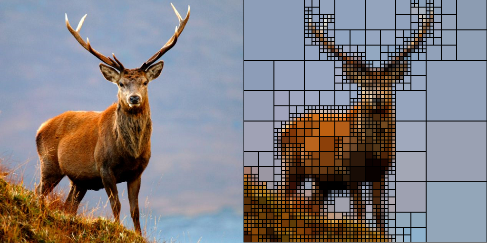

# Quadarto  

**Quadarto** is an Haskell script which performs image tessellation using a
[QuadTree][1] pattern. The algorithm iterates over the image merging similar
square regions of the images on the basis of their level of details.

The algorithm is developed in order as a small toy software for Haskell learning
purpose and I'll try to be idiomatic as much as possible.

## Usage

### Installation

Quadarto can be installed directly from source:

    git clone https://github.com/THeK3nger/quadarto.git
    cd quadarto
    cabal configure && cabal build

### Run

To execute the program, run the following command from the quadarto folder:

    cabal run <file_name> <color_threshold>

Where

 * `<file_name>` is the input file path.
 * `<color_threshold>` is a value who indicates how similar two colors have to
 be in oder to be merged together. Usually values between 50 and 100 are good
 enough.

For now, the software produces a `stag-out.png`. :P

## Development

There is still a lot of work to do on the algorithm. The software works but it
is still heavily non optimized and non idiomatic. I think can be interesting to
follow the various commits I'll do to see how the software evolve towards its
final idiomatic Haskell version. :)

  [1]: http://en.wikipedia.org/wiki/Quadtree
